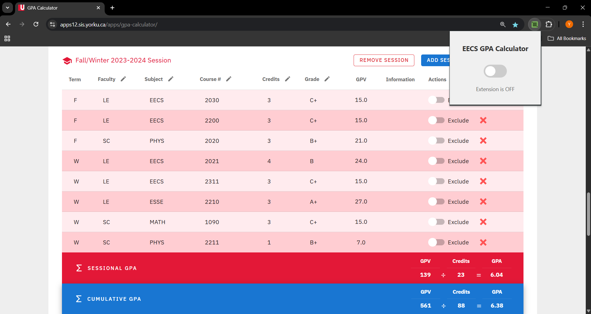
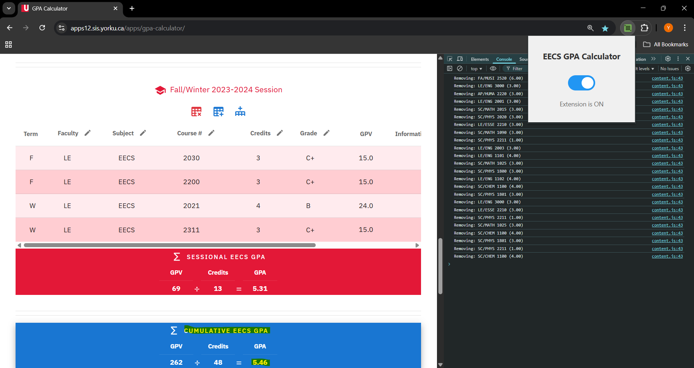

# EECS GPA Calculator Chrome Extension

A Chrome extension that enhances York University's GPA Calculator by filtering out non-EECS courses. This allows EECS students to easily calculate their major GPA, without having to manually remove courses.

## Features

- Toggle switch to enable/disable the extension
- Automatically removes non-EECS courses from the calculator
- Real-time updates when adding new courses
- Persists settings across browser sessions

## How It Works

1. **Extension Off**: Shows all courses in the GPA calculator
   

2. **Extension On**: Filters to show only EECS major courses
   

## Installation

1. Download or clone this repository
2. Open Chrome and go to `chrome://extensions/`
3. Enable "Developer mode" in the top right
4. Click "Load unpacked" and select the extension directory

## Usage

1. Navigate to [York University's GPA Calculator](https://apps12.sis.yorku.ca/apps/gpa-calculator/), (you must login with your York Passport first).
2. Click the extension icon in your browser toolbar
3. Toggle the switch to enable/disable EECS course filtering
4. The calculator will automatically update to show only relevant EECS courses

## Technical Details

The extension uses:
- Chrome Storage API for persistence
- MutationObserver for real-time updates
- Content Scripts for DOM manipulation
- Chrome Message Passing between popup and content scripts

## Notes

- This extension is specifically designed for York University's GPA Calculator tool
- When the extension is on, non-EECS courses are automatically hidden
- To show all their courses back, the user must turn off the extension and refresh the page
- If the user wants to add courses in the calculator, they must first turn off the extension then freely add courses by clicking "ADD COURSE" on the tool

## Contributing

Feel free to contribute to this project by submitting issues or pull requests.

## License

MIT License